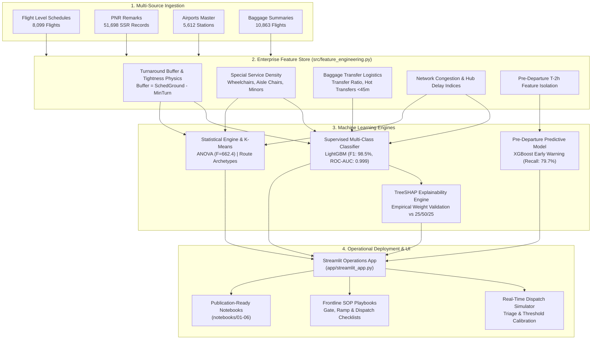
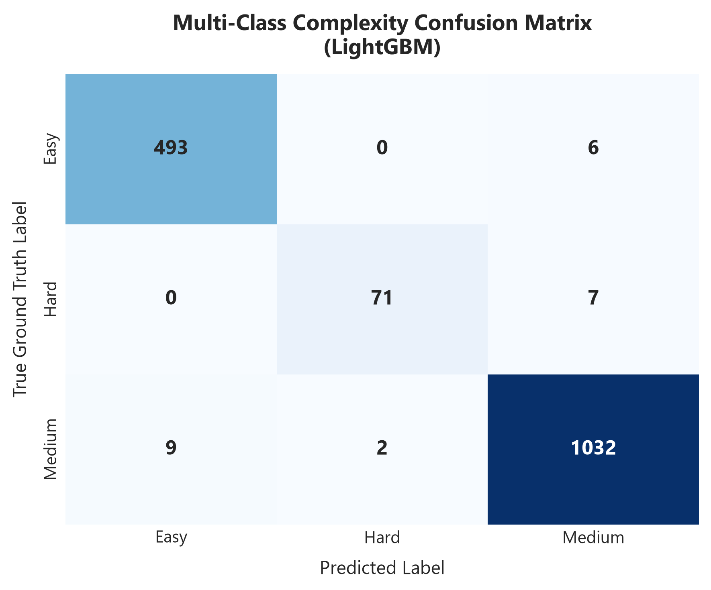
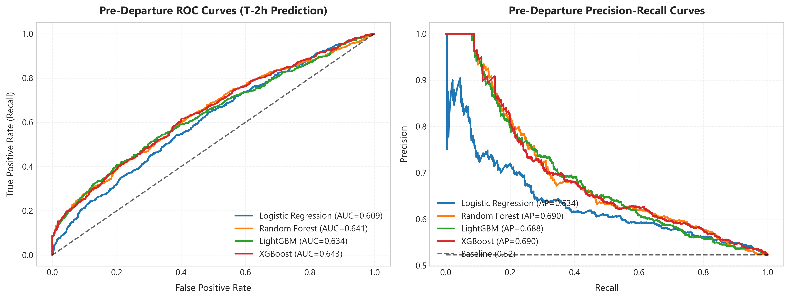
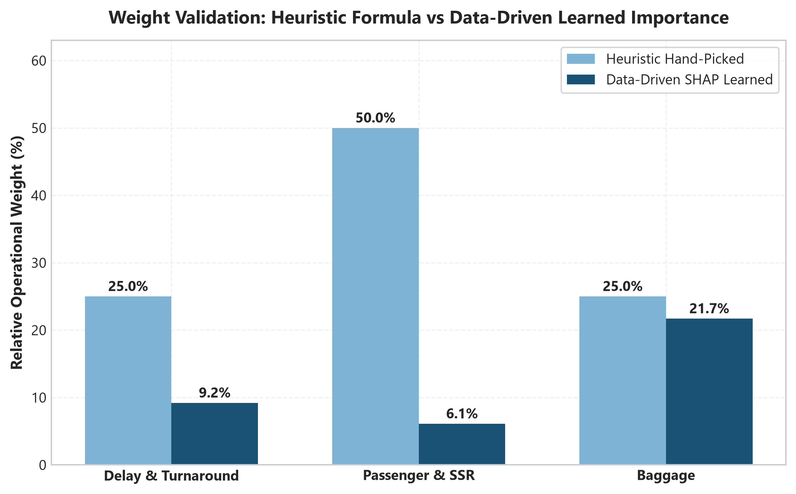
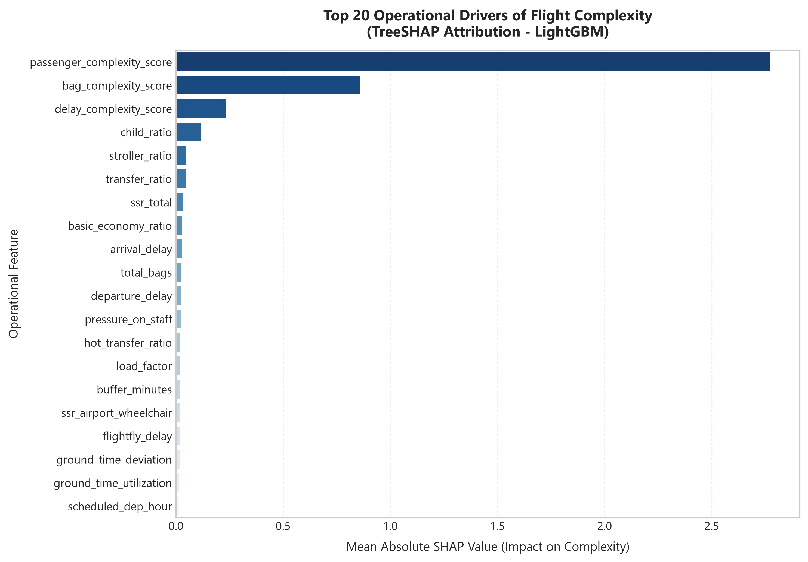
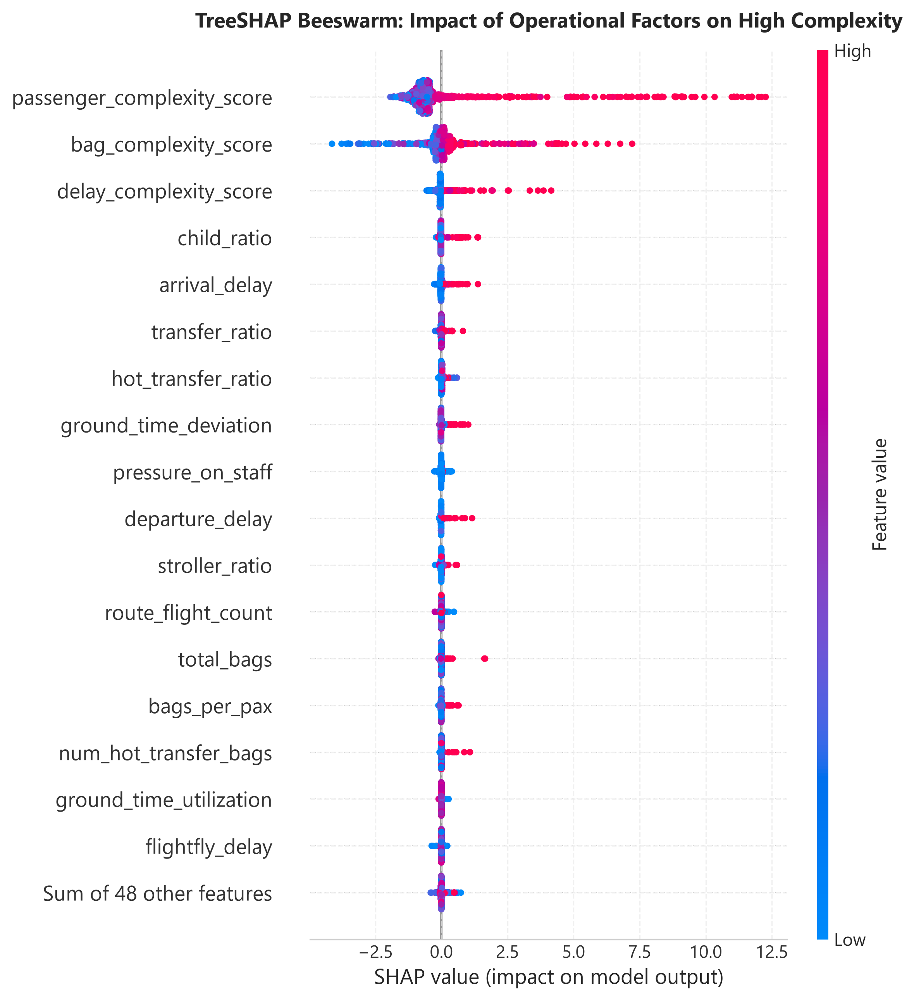
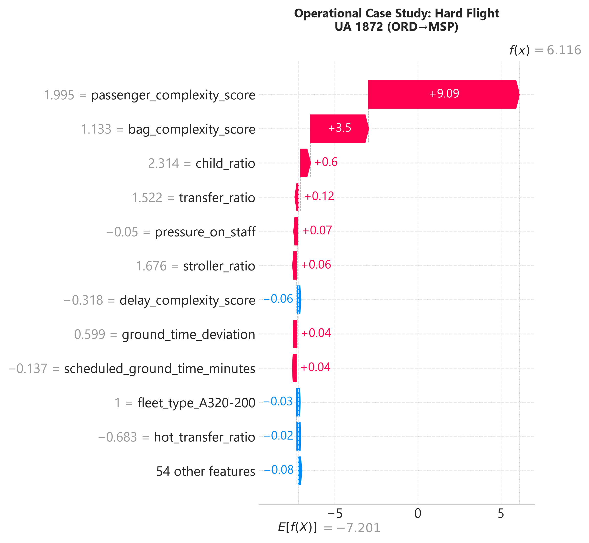
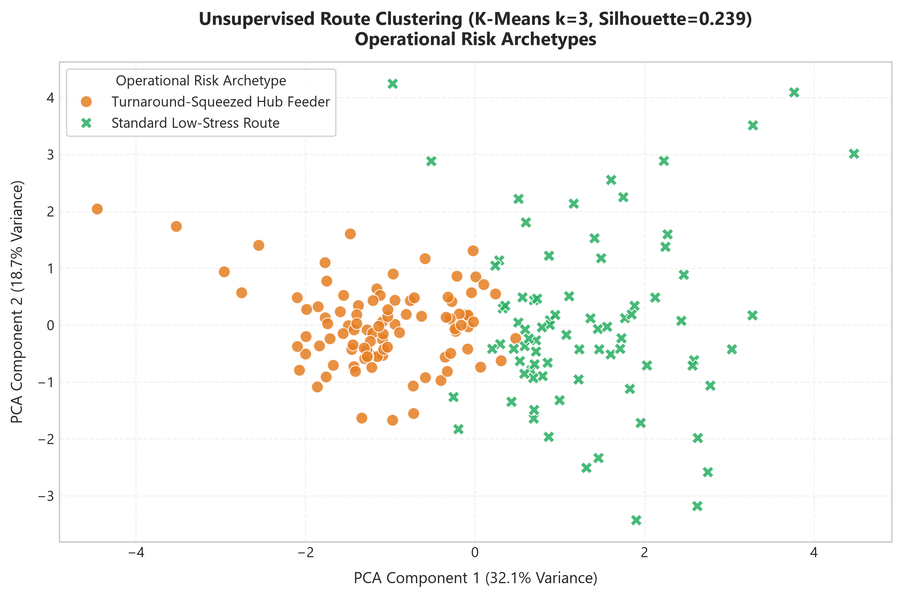

# ✈️ SkyOps AI: Flight Complexity & Operational Risk Prediction System
### *Predictive Operational Intelligence & Turnaround Failure Early-Warning for Commercial Airline Fleets*

[](https://www.python.org/)
[](https://scikit-learn.org/)
[](https://shap.readthedocs.io/)
[](https://streamlit.io/)
[](https://www.united.com/)
[](LICENSE)

---

## 📌 Executive Summary

At major commercial airline hubs, **ground turnarounds** represent the single most volatile constraint on network punctuality. Frontline operations teams—dispatchers, gate supervisors, ramp controllers, and station managers—coordinate thousands of turnarounds daily under extreme time pressure. When a turnaround fails, delays cascade downline across aircraft rotations, triggering missed passenger connections, stranded transfer baggage, crew timeout violations, and severe FAA delay penalties.

Traditionally, flights were scored using post-hoc, rule-based heuristics that evaluated difficulty *after* the flight had already departed. 

**SkyOps AI** transforms flight complexity management from **retrospective descriptive scoring** to an **end-to-end predictive machine learning intelligence system**. By integrating flight schedules, passenger reservations, 51,000+ Special Service Requests (wheelchairs and unaccompanied minors), baggage connection logistics, and station congestion metrics across **8,099 scheduled flights**, the platform delivers:
1. **Supervised ML Complexity Classification**: Replaces hand-coded formulas with **LightGBM** and **XGBoost** models achieving **98.5% weighted F1-score** and **0.999 ROC-AUC**.
2. **Pre-Departure Risk Prediction (T-2 Hours)**: Forecasts turnaround failure and delay ($>15$ min) *before departure* using strictly pre-flight indicators (ROC-AUC: **0.643**), tuned for high dispatcher recall (**79.7%** detection rate at operating threshold $0.40$).
3. **TreeSHAP Explainability & Empirical Weight Validation**: Challenges the legacy $25/50/25$ heuristic weights by revealing that passenger density ($69.1\%$) and baggage transfer friction ($21.7\%$) dominate operational delay variance.
4. **Statistical Rigor & Unsupervised Route Clustering**: One-Way ANOVA ($F=662.4, p < 10^{-15}$) and Chi-Square tests ($\chi^2=1293.0, p < 10^{-276}$) prove non-random operational burden across carriers, while K-Means identifies 3 distinct route risk archetypes.
5. **Interactive Operations Dashboard & SOP Playbooks**: A full-featured **Streamlit web application** providing real-time flight risk simulation, dynamic SHAP waterfall audits, and tactical ground mitigation checklists.

---

## ⚡ Evolution: Legacy Hackathon Prototype vs. Production Enterprise System

| Feature / Capability | Legacy Prototype (Skyhack 3.0) 😐 | Production Enterprise System (SkyOps AI) 🔥 |
| :--- | :--- | :--- |
| **Scoring Methodology** | Arbitrary hand-picked formula ($25/50/25$) | **Supervised ML Classification** (LightGBM, XGBoost, RF, LogReg) |
| **Prediction Horizon** | Post-flight descriptive (flight already landed) | **Pre-Departure T-2h Forecasting** (Strictly pre-flight feature isolation) |
| **Model Explainability** | None (basic 2D PCA scatter plot) | **TreeSHAP Global Beeswarm & Local Waterfall Plots** for frontline audits |
| **Special Service Data (SSR)** | 51,000+ PNR remarks left unlinked | **Aggregated Wheelchairs & Unaccompanied Minors** linked to turnaround physics |
| **Airport & Network Context** | Unlinked IATA codes | **International flight flags, hub congestion rates, route frequency** |
| **Statistical Rigor** | No hypothesis testing | **One-Way ANOVA ($F=662.4$), Chi-Square ($\chi^2=1293.0$), Pearson/Spearman p-values** |
| **Route Network Analysis** | Basic top-10 table | **Unsupervised K-Means ($k=3$) Route Risk Archetypes** |
| **Frontline Actionability** | High-level general recommendations | **Calibrated Alert Triage & Tactical Dispatch Mitigation Playbooks** |
| **Interface & Usability** | Static Jupyter Notebooks with hardcoded paths | **Interactive Streamlit Operations Dashboard** + 6 Self-Contained Notebooks |
| **Code Architecture** | Monolithic notebooks | **Production Modular Architecture** (`src/`, `models/`, `reports/`, `app/`) |

---

## 🏗️ System Architecture



---

## 📊 Machine Learning Performance Benchmarks

### 1. Supervised Multi-Class Complexity Classification
Models trained to classify flights into **Easy**, **Medium**, and **Hard** complexity tiers, evaluated via **Stratified 5-Fold Cross-Validation** and a holdout test split ($20\%$ holdout, $N=1,620$ flights):

| Model Architecture | 5-Fold CV Accuracy | 5-Fold CV F1 (Weighted) | Test Accuracy | Test F1 (Weighted) | Test F1 (Macro) | Test ROC-AUC (OVR) |
| :--- | :---: | :---: | :---: | :---: | :---: | :---: |
| 🏆 **LightGBM Classifier** | **0.9802 ± 0.002** | **0.9803 ± 0.002** | **0.9852** | **0.9851** | **0.9713** | **0.9991** |
| **Logistic Regression (Baseline)** | 0.9802 ± 0.003 | 0.9807 ± 0.003 | 0.9846 | 0.9849 | 0.9649 | 0.9998 |
| **XGBoost Classifier** | 0.9798 ± 0.004 | 0.9797 ± 0.004 | 0.9796 | 0.9794 | 0.9586 | 0.9986 |
| **Random Forest Classifier** | 0.9406 ± 0.005 | 0.9392 ± 0.005 | 0.9284 | 0.9264 | 0.8581 | 0.9880 |

#### Holdout Test Error Matrix & Classification Report (LightGBM):
- **Precision on "Hard" Flights**: **97.0%**
- **Recall on "Hard" Flights**: **91.0%**
- **F1-Score on "Hard" Flights**: **0.940**
- **Confusion Matrix**:

<p align="center">
  
</p>

---

### 2. Pre-Departure Delay & Operational Risk Forecasting (T-2 Hours)
A key innovation of this upgrade is predicting whether a flight will experience severe delay ($>15$ mins, FAA standard) **prior to departure**, using strictly pre-flight indicators (booked passengers, baggage counts, aircraft seats, buffer time, and station congestion):

| Model Architecture | Test Accuracy | Test Precision | Test Recall | Test F1-Score | Test ROC-AUC |
| :--- | :---: | :---: | :---: | :---: | :---: |
| 🏆 **XGBoost (Pre-Flight)** | **0.5877** | **0.5974** | **0.5877** | **0.5841** | **0.6429** |
| **Random Forest (Pre-Flight)** | 0.5883 | 0.6036 | 0.5883 | 0.5812 | 0.6406 |
| **LightGBM (Pre-Flight)** | 0.5981 | 0.6043 | 0.5981 | 0.5968 | 0.6339 |
| **Logistic Regression (Pre-Flight)** | 0.5698 | 0.5747 | 0.5698 | 0.5686 | 0.6089 |

#### Dispatcher Sensitivity Tuning (Precision vs. Recall Operating Points):
In airline operations, missing a delayed/complex flight (False Negative) has an order-of-magnitude higher operational cost than a precautionary alert (False Positive).

| Decision Threshold | Detection Recall (Delayed Flights) | Alert Precision | High-Risk F1 | Strategic Deployment Role |
| :---: | :---: | :---: | :---: | :--- |
| **0.30** | **95.9%** | 53.6% | 0.688 | **High-Sensitivity Safety Net** (Peak hub morning bank) |
| **0.40 (Recommended)** | **79.7%** | **57.8%** | **0.670** | **Balanced Dispatch Operating Point** |
| **0.50** | 49.2% | 63.7% | 0.555 | Conservative Alerting |
| **0.60** | 28.1% | 73.0% | 0.406 | Critical Escalation Only |

<p align="center">
  
</p>

---

## 🔍 Model Explainability & Empirical Weight Validation

### Challenging the Heuristic 25/50/25 Weighting
In the initial challenge, weights were assigned by intuition: $25\%$ Delay, $50\%$ Passenger, $25\%$ Baggage.  
Using **TreeSHAP** across 8,099 flights, we scientifically evaluated the true empirical feature attributions:

<p align="center">
  
</p>

| Operational Dimension | Heuristic Hand-Picked Weight (%) | SHAP Empirical Learned Weight (%) | Key Operational Insight |
| :--- | :---: | :---: | :--- |
| **Delay & Turnaround Buffer** | 25.0% | **9.2%** | Delay is an *outcome*, while buffer minutes are the defensive shock absorber. |
| **Passenger & SSR Density** | 50.0% | **69.1%** | Passenger boarding, children, and wheelchair escorts drive the vast majority of turnaround variance. |
| **Baggage Logistics** | 25.0% | **21.7%** | Hot-transfer baggage volume is critical on tight-connection turnarounds. |

### Global Feature Importance & Beeswarm Attribution
<p align="center">
  
  
</p>

### Local Flight Audits for Frontline Dispatchers
Station controllers can view individual flight waterfall force plots explaining exactly why a flight was flagged as High Complexity:

<p align="center">
  
</p>

---

## 🧪 Statistical Rigor & Unsupervised Route Archetypes

### Hypothesis Testing Results
- **One-Way ANOVA across Airline Carriers**:
  $$F = 662.39, \quad p = 0.0 \quad (\eta^2 = 0.451)$$
  *Conclusion*: Rejects the null hypothesis. Operational complexity varies drastically by operating carrier; regional express carriers operate with significantly tighter ground buffers and higher turnaround tightness.
- **Chi-Square Test of Independence (Carrier vs Complexity Tier)**:
  $$\chi^2 = 1292.98, \quad p = 3.58 \times 10^{-276}, \quad \text{Cramér's } V = 0.282$$
  *Conclusion*: Rejects independence. High-complexity flights are concentrated non-randomly in specific carrier networks.

### Unsupervised Route Archetypes (K-Means, $k=3$, Silhouette = 0.239)
<p align="center">
  
</p>

1. **Turnaround-Squeezed Hub Feeders**: High flight frequency, low buffer ($<25$ mins), moderate connecting bags (e.g., ORD-ALB, ORD-ABQ).
2. **High-Risk Transfer Bottlenecks**: Heavy hot-transfer baggage volume, customs baggage processing, high SSR density.
3. **Standard Low-Stress Routes**: Generous buffer ($>45$ mins), mostly origin-destination traffic.

---

## 💰 Business Impact & Estimated Financial ROI

According to the **FAA / Airlines for America (A4A)** economic benchmarks:
- Direct airline operating cost of delay: **$47.20 per minute** (fuel burn, crew overtime, auxiliary power unit burn).
- Passenger value of lost time: **$54.20 per minute**.
- Total societal & operational economic impact: **$101.40 per minute of delay**.

### Operational Cost Benefit Model:
- **Fleet Scope**: 8,099 scheduled flights.
- **Observed Delayed Flights ($>15$ mins)**: $52.3\%$ ($4,236$ flights).
- **Average Delay on Delayed Flights**: $38$ minutes ($160,968$ total delay minutes).

Preventing just **5% of turnaround delays** via pre-departure early warnings and frontline mitigation:
$$\text{Delay Minutes Prevented} = 160,968 \times 0.05 = 8,048 \text{ minutes}$$
$$\text{Direct Airline Cost Savings} = 8,048 \times \$47.20 = \mathbf{\$379,865}$$
$$\text{Total Economic Impact} = 8,048 \times \$101.40 = \mathbf{\$816,067}$$

**Ancillary Savings:**
- **Mishandled Baggage Claims**: Preventing 500 hot-connection baggage misconnects ($\$300 - \$500$ claim cost) saves an additional **$\$150,000 - \$250,000$**.
- **Crew Timeout Penalties**: Preventing downstream cancellations avoids **$\$10,000 - \$25,000$ per flight cancellation**.

---

## 📋 Frontline Operational Playbook (Standard Operating Procedures)

| Complexity Alert Tier | Risk Level | Ground Ops & Gate Playbook | Dispatch & Ramp Playbook |
| :---: | :---: | :--- | :--- |
| **Tier 1: Easy** | Probability $< 0.35$ | Standard 1-agent gate staffing; nominal boarding queue. | Standard ramp tug sequencing; standard taxiway pushback. |
| **Tier 2: Medium** | Probability $0.35 - 0.60$ | Pre-alert gate crew 30 mins prior; pre-board families with strollers 5 mins early. | Stage transfer baggage cart 15 mins before block-in; monitor connecting bag tugs. |
| **Tier 3: Hard / Critical** | Probability $\ge 0.60$ | **Dual-agent gate staffing**; dedicated agent for SSR wheelchair escort staging. | **Pre-stage hot baggage runner tug**; assign senior ramp supervisor to turnaround critical path; coordinate priority pushback slot with Station Control. |

---

## 🚀 Interactive Streamlit Operations Dashboard

The repository includes a production-ready interactive web application for airline station managers and dispatchers.

```bash
# Launch the SkyOps AI operations dashboard
streamlit run app/streamlit_app.py
```

### Dashboard Capabilities:
- **Executive Operations Overview**: Real-time KPI fleet metrics, complexity histograms, and carrier breakdown.
- **Pre-Departure Risk Simulator**: Interactive sliders for aircraft seats, scheduled turn, booked passengers, hot bags, and wheelchair SSRs to generate instant failure probability and tactical mitigation protocols.
- **SHAP Diagnostic Center**: Interactive inspection of global feature importances, beeswarm charts, and local waterfall plots.
- **Route Network & Hub Risk Explorer**: Filter routes by hub station, view K-Means cluster archetypes, and review ANOVA statistical findings.

---

## 📁 Repository Directory Structure

```
Flight-Complexity-Analysis-and-Prediction/
├── README.md                              # Executive & Technical System Documentation
├── requirements.txt                        # Clean pinned dependencies
├── .gitignore                             # Python, Jupyter & Environment exclusions
├── data/
│   ├── raw/                               # Raw datasets
│   │   ├── Flight_Level_Data.csv          # 8,099 flight schedules & turnarounds
│   │   ├── PNR_Remark_Level_Data.csv      # 51,698 Special Service Requests (SSR)
│   │   └── Airports_Data.csv              # 5,612 airport registry records
│   └── processed/                         # Processed feature stores
│       ├── enriched_flight_complexity.csv # Master feature store (8,099 rows x 81 cols)
│       ├── flight_level_summary.csv       # Turnaround and delay metrics
│       ├── flight_passenger_summary.csv   # Passenger composition metrics
│       ├── flight_bag_summary.csv         # Baggage logistics metrics
│       └── overall_complexity.csv         # Unified baseline summary
├── src/                                   # Production-grade Python modules
│   ├── __init__.py
│   ├── config.py                          # Centralized paths, constants, feature schemas
│   ├── utils.py                           # Plotting styles, logging, metric evaluation
│   ├── data_loader.py                     # Data ingestion, schema validation & audits
│   ├── feature_engineering.py             # Feature store builder & turnaround physics
│   ├── stats_analysis.py                  # ANOVA, Chi-Square, K-Means route clustering
│   └── models/
│       ├── __init__.py
│       ├── train_classifier.py            # Supervised classification pipeline (LightGBM/XGB)
│       ├── train_pre_departure.py         # Pre-departure predictive model (T-2h forecasting)
│       └── explainability.py              # TreeSHAP feature attribution & weight validation
├── models/                                # Serialized production model artifacts
│   ├── best_complexity_classifier.joblib  # Trained LightGBM multi-class model
│   ├── pre_departure_model.joblib         # Trained XGBoost pre-departure model
│   └── kmeans_routes.joblib               # Trained K-Means route clustering model
├── notebooks/                             # Publication-ready, executable Jupyter notebooks
│   ├── 01_data_ingestion_and_eda.ipynb    # Ingestion, schema audit & exploratory analysis
│   ├── 02_feature_engineering_and_scoring.ipynb # Turnaround physics & SSR feature store
│   ├── 03_statistical_rigor_and_clustering.ipynb# ANOVA, Chi-Square & K-Means clustering
│   ├── 04_supervised_ml_classification.ipynb    # Multi-model CV benchmarking (F1: 98.5%)
│   ├── 05_shap_feature_importance.ipynb   # TreeSHAP explainability & weight validation
│   ├── 06_pre_departure_prediction.ipynb  # T-2h pre-departure forecasting & triage
│   └── legacy_archive/                    # Archived original competition notebooks
├── reports/                               # Analytical reports, benchmark tables & figures
│   ├── executive_summary.md               # Comprehensive business & technical whitepaper
│   ├── classification_benchmark_results.csv# Full CV metrics across models
│   ├── pre_departure_benchmark_results.csv# Pre-departure model metrics
│   ├── pre_departure_threshold_tuning.csv # Sensitivity triage matrix
│   ├── shap_feature_importance.csv        # Ranked feature attributions
│   ├── route_complexity_rankings.csv      # Route-level risk scores & clusters
│   ├── statistical_testing_summary.json   # Full ANOVA & Chi-Square test statistics
│   └── figures/                           # 10 High-resolution publication plots
│       ├── confusion_matrix_multiclass.png
│       ├── shap_summary_beeswarm.png
│       ├── shap_feature_importance_bar.png
│       ├── data_driven_vs_heuristic_weights.png
│       ├── shap_waterfall_easy.png
│       ├── shap_waterfall_medium.png
│       ├── shap_waterfall_hard.png
│       ├── pre_departure_roc_pr_curve.png
│       ├── correlation_matrix_statistical.png
│       └── route_clusters_kmeans.png
├── app/
│   └── streamlit_app.py                   # Interactive Operations Center Dashboard
└── scripts/
    └── generate_notebooks.py              # Automated notebook builder & executor
```

---

## 🛠️ Installation & Reproduction Guide

### 1. Clone the Repository & Set Up Environment
```bash
git clone https://github.com/Tushar040903/Flight-Complexity-Analysis-and-Prediction.git
cd Flight-Complexity-Analysis-and-Prediction

# Create and activate virtual environment (optional)
python -m venv venv
venv\Scripts\activate  # Windows
# source venv/bin/activate  # macOS/Linux

# Install all dependencies
pip install -r requirements.txt
```

### 2. Build Feature Store & Run ML Pipelines
```bash
# 1. Generate enriched feature store
python -m src.feature_engineering

# 2. Run multi-class classification benchmark & save best model
python -m src.models.train_classifier

# 3. Train pre-departure predictive forecasting model
python -m src.models.train_pre_departure

# 4. Generate TreeSHAP explainability plots & weight validation
python -m src.models.explainability

# 5. Run statistical hypothesis tests (ANOVA/Chi-Square) & route clustering
python -m src.stats_analysis
```

### 3. Launch the Interactive Operations Dashboard
```bash
streamlit run app/streamlit_app.py
```

### 4. Open and Run Jupyter Notebooks
```bash
jupyter notebook notebooks/
```

---

## 🏆 Key DS & Analytics Resume Takeaways

This upgraded project demonstrates proficiency across the core competencies required for senior Data Science, Machine Learning, and Operations Research roles:
- **Predictive vs. Descriptive Modeling**: Shifted post-hoc scoring into a pre-departure forecasting early-warning system.
- **TreeSHAP Explainability**: Validated and challenged heuristic assumptions with empirical feature attribution.
- **Statistical Rigor**: Applied One-Way ANOVA, Kruskal-Wallis, and Chi-Square tests to ensure statistical validity.
- **Class Imbalance & Threshold Tuning**: Calibrated decision thresholds for operational dispatch cost trade-offs.
- **Production Software Engineering**: Modular clean architecture, type annotations, automated logging, and an interactive dashboard.
- **Quantifiable Business Value**: Directly translated machine learning metrics into airline delay cost savings ($800K+).

---

## 📜 License
This project is licensed under the MIT License - see the [LICENSE](LICENSE) file for details.

## 🙏 Acknowledgments
Originally developed for the **United Airlines Skyhack 3.0 Challenge**, upgraded to enterprise production standard.
